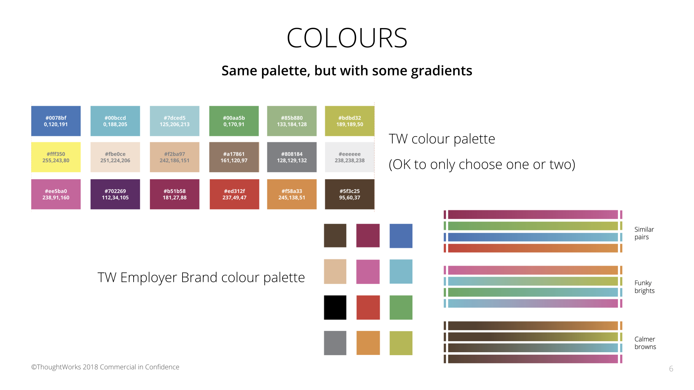

# ThoughtWorks Theme

This is a collection of IDEs theme based on the ThoughtWorks Website Design colour palette. The colour palette is also as the same as the colours in our keynote template.



## How to use

There are READMEs in every directory such as `JetBrains`, `Terminal`, `VisualStudioCode`, and so on. Find what you want and install the themes by the instruction.

## Contribution

Basically there're several ways to contribute this repository.

- Define a theme in your IDE and export it as a importable setting patch.
- Export a readable theme file(e.g. `xml`) and convert it within the ThoughtWorks colours([Docs](#convertor)).
- Check if there is instruction in the corresponding README and follow it.

### Convertor

The convertor developed under `python3` and via TDD way. It will convert all the colour-like string (`#[0-9a-f]{6}`) in a readable theme file to the nearest colour (least euclidean distance) in palette.

You can use it like,

```shell
    python3 convert.py ThoughtWorks.palette <readable_theme_file>
```

in which the `ThoughtWorks.palette` is a palette file with lines of colour-like string.

And also test the convertor by

```shell
    python3 convert.test.py
```